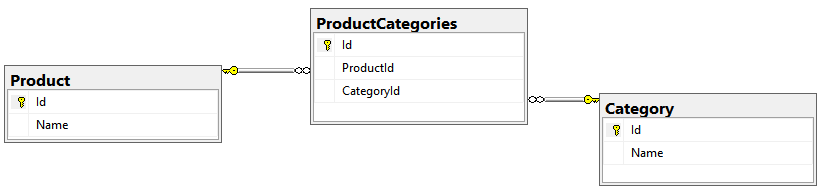
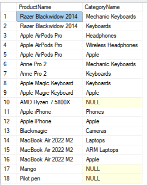

# MindBox Vacancy Task
This a solution for MindBox .NET developer vacancy from [hh.ru](https://hh.ru/vacancy/67075607). I really like your studio: office, stack, hardware. So, I'll be happy if I join your team. I hope my code matches your standards: please enjoy :)

## Solutions
---
* [Library](src/Planimetry/)
* [Library Unit Tests](tests/Planimetry.UnitTests/)
* [SQL Query](mssql/ProductWithCategory.sql)

## Technologies
---
* [.NET Standard 2.1](https://docs.microsoft.com/ru-ru/dotnet/standard/net-standard?tabs=net-standard-2-1)
* [.NET 6.0](https://dotnet.microsoft.com/en-us/download/dotnet/6.0)
* [NUnit](https://nunit.org/), [FluentAssertions](https://fluentassertions.com/)
* [MS SQL Server](https://www.microsoft.com/ru-ru/sql-server/sql-server-2019)

## Planimetry Library Explained
---
The task was to create a small library of planimetry shapes that includes:
* Triangle, it's Area by 3 sides, checking for a right triangle
* Circle and it's Area by radius
* Unit tests coverage
* Ease of adding other shapes

I chose .NET Standard 2.1 because it compatible with .NET Framework and .NET Core, and also allows a developer to use new language features. <br />

---

### Shape

All the shapes are presented with a [IShape](src/Planimetry/Core/IShape.cs) abstraction that has an Area attribute. So, it's easy to add a new one: just create a new class and implement the interface. <br />
```csharp
public interface IShape
{
    double Area { get; }
}

public class Rectangle : IShape
{
    ...
}
```

---

### Triangle

You can create a triangle passing 3 sides separately
```csharp
var triangle = new Triangle(3, 4, 5);
```
Or using a list of 3 elements. If the list contains more or less than 3 elements, then the ArgumentException will be thrown.
```csharp
double[] triplet = {3.0, 4.0, 5.0};
var triangle = Triangle.From(triplet);
```

It's easy to get an area or check if a triangle is right
```csharp
var triangle = new Triangle(3, 4, 5);
Console.WriteLine(triangle.Area); // 6.0
Console.WriteLine(triangle.IsRight); // true
```

The library prevents you of initializing a triangle that does not exist due to [triangle inequality](""https://en.wikipedia.org/wiki/Triangle_inequality""). In this case the exception will be thrown.
```csharp
public class TriangleInequalityException : Exception { ... }
```

---

### Circle

The circle has radius and area
```csharp
var triangle = new Circle(2.4);
Console.WriteLine(triangle.Area); // 18.0955736847
Console.WriteLine(triangle.Radius); // 2.4
```

---

### Unit tests

All the shapes covered with [Unit Tests](tests/Planimetry.UnitTests/)

---

## MSSQL Solution Explained
---
The task was to create a query that selects all the pairs of products and their categories. Moreover, each product can have multiple categories, and each category can have various products. Products without any category should be selected too. So, we have to build a many-to-many relationship there.

The classic approach is to create 3 tables: Products, Categories, and ProductCategories. The last one is some kind of mediator that allows us to organize the relationship replacing many-to-many with 2 one-to-many relationships.



The best way to see how it works is to launch the scripts yourself. You can initialize database and prepare data for it using [this script](mssql/InitializeDatabase.sql). Then run the [script from solutions](mssql/ProductWithCategory.sql), you should see the following result:



In this case the products which have no categories have Category name NULL.